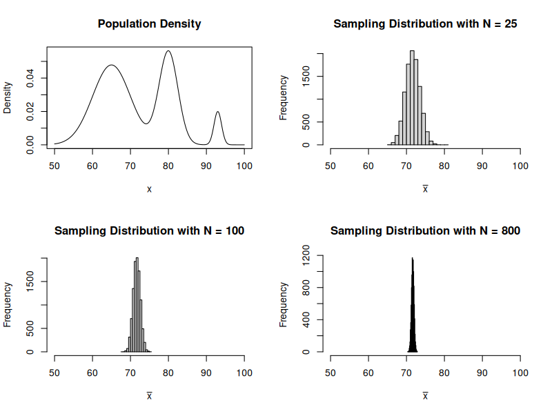
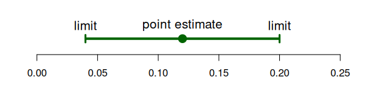
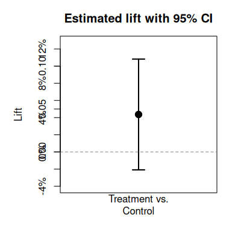
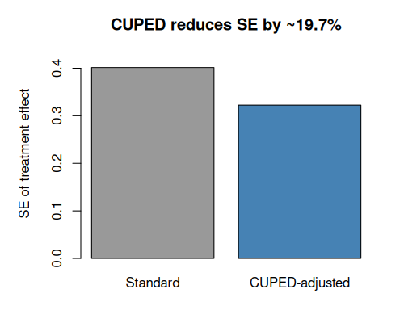

# 10: A/B Testing and Causal Inference

## Theory to Practice with Dr. Demetri Pananos


([pdf](media/ab_testing_lecture.pdf))

## Who Am I?

* Dr. Demetri Pananos

- Late 2016 Data Analyst Working in A/B Testing
- Late 2017 - Late 2022: PhD in Epidemiology & Biostatistics
- Mid 2022 - Late 2023: Staff Data Scientist at Zapier, lead A/B Testing
- Late 2023 - Late 2024: A foray into Media Mixed Modelling
- Late 2024 - Now: Statistics Engineer at Eppo/Datadog.

## Causal Inference? In This Economy?

* Hot take: _All business questions are causal._

* We don't just need data, we need the _right data_
* The _right data_ can be hard to obtain, and without it we can be led astray:
	* Thinking a decision will help when it hurts
	* Thinking a decision will impact a lot when it won't
	* Thinking we are pulling a lever when we aren't

## Causal Inference for Cheap

- A/B tests are the easiest way to answer causal questions.
- Much to know!
	* A little math
	* Influencing Teams
	* When you need more math and when you don't

## Agenda

* Stats refresher
* Pokemon and Causal Inference
* Confounding & Assumptions for Causal Inference

_Break_

* Practical Guidance for Running A/B Tests


# Stats Refresher

## The Central Limit Theorem

The Central Limit Theorem tells us that the sample mean can be thought of as a normal random variable. Let $Y_1, \cdots, Y_n$ be i.i.d random variables so that $E[Y] = \mu$ and $\operatorname{Var}(Y) = \sigma^2$.

Recall that $$ \bar Y = \dfrac{1}{n} \sum_{i=1}^n Y_i $$

CLT says $$ \bar Y \sim \operatorname{Normal}(\mu, \tfrac{\sigma^2}{n}) $$

This means that $E[\bar Y] =  \mu$ and  $\operatorname{Var}(\bar Y) = \tfrac{\sigma^2}{n}$.

## Thought Exercise: Calculus Grades

I want you to imagine:

* You sit out on the quad and ask students what grade they got in Calculus.
* After every $N$ students, you calculate the sample mean and start again.
* You do this _for a very very long time_.

Consider:

* What would the histogram of of sample averages look like?
* What happens as $N$ gets bigger and bigger?
* Does the distribution of the actual grades matter for the answer above?

## Example of CLT in Action



## Hypothesis Tests For Means

We can perform a hypothesis test for the mean by computing the following test statistic

$$ Z = \dfrac{\bar y - \mu_0}{\sqrt{\dfrac{s^2}{n}}} $$

The test statistic for two means being equal is

$$ Z = \dfrac{\bar x - \bar y}{\sqrt{\tfrac{s^2_x}{n_x}  + \tfrac{s^2_y}{n_y}}} $$

## Confidence Intervals & P Values

Two ways to talk about a hypothesis test:

* P Value: Probability we see a result more extreme than what we say assuming the null is true and our background assumptions about the data are true.

* Confidence Intervals: $100\% \times (1-\alpha)$ probability of containing the mean upon repeated construction.



# Pokemon and Causal Inference

## Fossils at Mt. Moon


* Players must choose either the dome fossil or the helix fossil.
* Once the choice is made, the other fossil is never attainable -- effectively gone forever.
* Hypothetically two possible games!  One in which you take dome fossil and one in which you take helix.
* What can Pokemon teach us about causal inference?

## Rubin's Causal Model & Potential Outcomes

Let $A_i=0, 1$ be an indicator for some treatment.  Then $Y_i(A_i)$ is the potential outcome under that treatment.

Example: "_My headache went away because I took an aspirin_"

* $A_i=0$ means not taking the aspirin, and $Y_i(A_i=0)$ is my headache status having not taken the aspirin.
* $A_i=1$ means taking the aspirin, and $Y(A_i=1)$ is my headache status having taken the aspirin.

## We Never See Both Potential Outcomes

In reality, we never know both $Y_i(A_i=0)$ and $Y_i(A_i=1)$ -- we can only ever see one.

We can relate the observed data to the potential outcomes via the _switching equation_

$$ Y_i = A_i Y_i(A_i=1) + (1-A_i) Y_i(A_i=0) $$

## Causal Effects

If I knew both potential outcomes, I could compute the casual effect of the action

$$ \tau_i = Y_i(A_i=1) - Y_i(A_i=0) $$
Let's assume $Y_i(A)$ can be 0 (no headache) or 1 (headache). What each of these mean about the treatment effect?

* $\tau_i = 0$
* $\tau_i = 1$
* $\tau_i = -1$


## Average Causal Effects

We can talk about the average potential outcome $E[Y(A)]$.   This is different than $E[Y\mid A]$!


Often, want to know how things change on average, so could compute

$$ \tau = E[Y_i(A_i=1)] - E[Y_i(A_i=0)] $$

or

$$ \lambda = \dfrac{E[Y_i(A_i=1)]}{E[Y_i(A_i=0)]} - 1 $$


## How Can We Estimate Causal Effects?

If we can only ever see one potential outcome, how can we ever estimate causal effects?

Can't we just look at people who took aspirin and did not take aspirin and see what the difference was?

What if:

  * Only people with chronic headaches chose to use aspirin?
  * People randomly chose aspirin?

Discuss

## Confounding

Confounding: type of bias that occurs when the association you observe between an exposure and an outcome is distorted by a third variable

Note that **generally** $E[Y(A)] \neq E[Y|A]$!  This is a subtle distinction here and you should make sure you understand this part.

Let's look at an example

## Confounding Example

```r
# True causal effect:
  # Aspirin relieves headache
  #  = 2/5 - 3/5
mean(d$y1) - mean(d$y0)

# If we just looked at data:
  # Aspirin increases headache
  # = 2/3 - 1/2
mean(d$y[d$a==1]) - mean(d$y[d$a==0])
```

## How Can We Do Causal Inference At All?

* Never observe the two potential outcomes
* Confounding means we can't just look at data

How can we ever do causal inference at all?  Is this hopeless?

## 3 Assumptions for Causal Inference

I said **generally** $E[Y(A)] \neq E[Y|A]$, but under these 3 assumptions $E[Y(A)] = E[Y|A]$, and we can do causal inference!

* **Consistency**: That when we do $A=a$ we observe $Y_i = Y(A_i)$.
* **Positivity**: That $0 < \Pr(A) < 1$
* **Exchangeability**: This is perhaps the most important assumption... that $Y(1), Y(0) \perp A$.


If we have consistency, positivity, and exchangeability, then it is safe to assume $E[Y_i \mid A=a] = E[Y_i(A=a)]$.

## Randomization Gives Us All 3!

The easiest way to achieve all 3 is via randomization.

* Randomization gives us consistency so long as the implementation works (more on this later)
* Randomization gives us positivity by design (though we should check that this works)
* Randomization gives us exchangeability by design.

So long as we can randomize, we can compare group means and that is a valid estimate of the causal effect!

## Sounds Simple, Right?

* Just randomize and run a z-test and we're good?
* "_Experimentation is not a math problem; it is a people problem_" -- Demetri Pananos, Ph.D.
* In the next section, we will discuss what it means to run A/B tests in real life.  As we will see, it is much different than a statistics class may make it seem.

# Break

# Practical A/B Testing

## Steps To an A/B Test

1. Convince people to run an A/B test
2. Get Specific!
3. Determine how long the test should run
4. Align with engineering
5. Run the test and monitor
6. Analyze the test
7. Communicate results

## A "Real Example"

* You're a DS at a company.
* New idea to increase upgrades & retention.
* You think randomizing newly signed up users is a good way to test this.
* Let's put these into action.

## Convince People To Run an A/B Test

* A/B Tests take time, teams want to make decisions now.
* "Can't we roll out and compare before and after?" -- think about exchangeability here.
* Benefits to experimentation: Avoiding bias in decision making (HiPPO principle) and evidenced based decision making.
* Your job is to improve decision making, not force statistics on people.  Be compassionate and listen to people's fears and desires.

## Get Specific!

* "We think this will increase upgrades"
  - What counts as an upgrade? (e.g. last through the free trial?  What if there is a refund? Does time matter?)
  - Is this data readily available?
* Guardrails
  - What are we hoping _doesn't_ change? (e.g. latency? bounce rate?)
* Ensure your organization aligns with metric definitions.
* When are we going to run the test?

## Determine How Long the Test Should Run

* Run a power calculation.  To do this, you need to know your metric's mean and standard error.
* Express the MDE (minimal detectable effect) as a function of run time.
* If you're doing a 50/50 split and using $\alpha = 0.05$ and $1-\beta = 0.8$, then $MDE \approx \dfrac{2.8 \sqrt{2 \tfrac{\sigma^2}{N}}}{\mu}$

## Align With Engineering

* Assignments are created using feature flags, data are created from events.
  * Does the flag fire at the right entry point?
  * Do we need custom events for anything?
  * Are we firing _counterfactual events_?


## Run The Test and Monitor

* Stuff Breaks!  It is best to catch it early if possible.  Try to check:
  * You don't have a sample ratio mismatch
  * You don't have too many multiple exposures
  * You have metric data for both groups


## Run The Test and Monitor

* Sample Ratio Mismatch: When observed fractions allocated to treatment/control do not match intended.

```r
chisq.test(c(34603, 34583), p = c(0.5, 0.5))
```

## Analyze The Test

* If all looks good and you hit your sample size, you can analyze the test.
* A z-test is perfectly fine in most cases*

## Analyze The Test

* A lot of places report "The Lift", which is estimated as

$$ \hat \lambda = \dfrac{\bar y_t}{\bar y_c} - 1$$
* This is nice because it is _unitless_ and so is comparable across metrics and time.

* A confidence interval for this quantity is $\hat \lambda \pm z_{1-\alpha/2} \sqrt{\widehat{\mathrm{Var}}(\hat{\lambda})}$ obtained via the Delta Method

$$
\widehat{\mathrm{Var}}(\hat{\lambda})
\;=\;
\left(\frac{\bar{y}_t}{\bar{y}_c}\right)^2
\left(
\frac{s_t^2}{n_t\,\bar{y}_t^{2}}
\;+\;
\frac{s_c^2}{n_c\,\bar{y}_c^{2}}
\right)
$$


## Communicate Results

* Point estimates are not enough, always report a confidence interval.  In our case



>"The treatment had an estimated lift of 4.31%.  If we had run this test at a different time, or on a different group of users, we would expect the lift would be between -0.58% and 9.2%.  Since the confidence interval contains negative lifts, my recommendation would be to ship control"

## Communicate Results

* _Most_ AB tests are not winners.
* Twyman's law:
  - "Any figure that looks interesting or different is usually wrong"
* Winner's Curse:
  - Statistically significant results are often over estimates of the true effect

## The Peeking Problem

* Many of the statistical guarantees only apply if you look once.
* **Peeking**: Taking many looks at the data and actioning whenever there is statistical significance.
* PMs have a big desire to do this

* Example: Consider collecting half the planned sample, then testing each half.  If any of the 2 are stat sig, ship.
* Under the null, this results in a false positive rate of ~8.2%.  Should be around 5%!

## Always Valid Confidence Intervals

* There exist "always valid" ([sequential](https://docs.geteppo.com/statistics/confidence-intervals/analysis-methods/#sequential-analysis)) methods.
* Pros:
  - Can peek at results and make decisions at any time without inflating false positive rate.
  - No need to predetermine sample size -- eliminates power analysis up front.
  - Faster decisions when effects are large (ship early or kill early).
* Cons:
  - Wider confidence intervals $\implies$ less statistical power for the same sample size.
  - When effects are small or moderate, takes _longer_ to reach a conclusion than fixed-sample.
  - You trade power for flexibility.

[Link: https://docs.geteppo.com/statistics/confidence-intervals/statistical-nitty-gritty/#sequential](https://docs.geteppo.com/statistics/confidence-intervals/statistical-nitty-gritty/#sequential)

## PMs Want To Go Fast

* Time is always the biggest constraint/scarcest resource.

$$ MDE \approx  \dfrac{2.8 \sqrt{2 \dfrac{\sigma^2}{N}}}{\mu}$$

* Samples = Time.  "We Need this $N$ samples" -- not actually!  What other lever can we pull?

## CUPED

* CUPED is a technique for _variance reduction_ (essentially making $\sigma^2$ smaller).
* Idea: Find something that is correlated with $y$, but is not affected by the treatment.

$$\operatorname{Var}(\tilde Y) = \operatorname{Var}(Y)(1-\rho^2) $$

* Easiest thing to do: Use the outcome (e.g. past revenue) from before the experiment?
* Rationale:  People who spent a lot before the period are likely to spend a lot again!  Hence, correlation!

## CUPED: How It Works

1. Pick a pre-experiment covariate $X$ (e.g. total revenue in the 28 days _before_ the test).
2. Compute the adjusted outcome for each user:

$$\tilde Y_i = Y_i - \theta (X_i - \bar X)$$

where $\theta = \operatorname{Cov}(Y, X) / \operatorname{Var}(X)$ (i.e. a regression coefficient).

3. Run your usual z-test on $\tilde Y$ instead of $Y$.

Because $\operatorname{Var}(\tilde Y) = \operatorname{Var}(Y)(1 - \rho^2)$, a correlation of $\rho = 0.5$ cuts variance by 25%.

## CUPED: Illustration



## CUPED: Takeaways

* CUPED is like regression adjustment.
* The higher $\rho$ between pre-experiment covariate and outcome, the bigger the variance reduction.
* Practical guidance:
  - Use the _same metric_ measured in a pre-period as the covariate (e.g. pre-experiment revenue to predict experiment revenue).
  - No pre-experiemnt data?  Use things unaffected by exposure (e.g. Weekday assigned, mobile device)
  - The covariate **must** be measured _before_ randomization so it is not affected by treatment.
  - Most A/B testing platforms (Eppo, Statsig, etc.) support CUPED and can use _multiple_ pre experiment variables to reduce variance even further!

## A Lot To Learn

* Don't be discouraged, there is a lot to learn!
* Don't try to be perfect, try to make justifiable decisions.

# Fin
