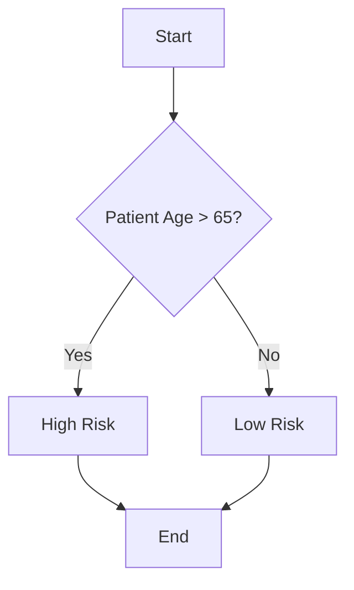
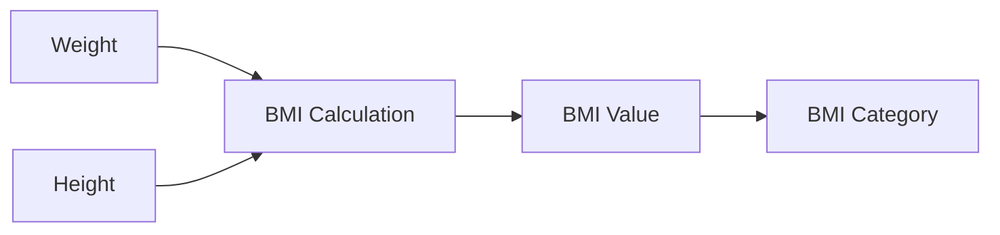

<!---
- 0) Jupyter notebooks
  - Magic commands, especially %pip
  - ! shell commands
  - https://www.dataquest.io/blog/jupyter-notebook-tutorial/
- 1) Debugging
  - List refs
  - Programming is doing things that don't work over and over until it does
  - Rubberducking
  - debugging tools
    - in-code debugging
      - if DEBUG
      - console.log
      - `break` and `exit`
      - logging
    - console debugging with `pdb` (mention)
      - breakpoints
      - pdb.set_trace()
    - in-IDE debugging with VS Code
  - common issues
    - common error messages
    - malformed/missing data
    - counting errors
  - Examples (minimal dependencies/background knowledge, run in jupyter if possible)
    - Live Demo!
    - Assignment 
- 2) Working with data bigger than memory
  - List refs once topics chosen
  - pandas, polars, spark, duckdb, dask #FIXME: Which best to focus on for students new to this?
  - pandas vs polars?
    - pandas 3.0 → arrow backend
    - polars based on rust, lazy & streaming api's
  - Larger-than-memory operations
    - What's easy? "Ridiculously parallelizable", scan-based (mean, mode)
    - Hard? Non-partitioned joins/merges
-->

# Debugging and Big Data: When Your Code Has a Fever and Your Data Won't Fit 🐛💾

### Lecture Outline

1. **Jupyter Notebooks**
   - Magic commands and shell integration
   - Best practices for interactive coding

2. **Debugging Python**
   - Debugging mindset and common errors
   - Observing program behavior
   - In-code debugging techniques
   - Console debugging with pdb
   - VS Code debugging interface
   - Advanced debugging tools

3. **Simplifying Failures**
   - Delta debugging algorithm
   - Manual simplification techniques
   - Benefits of smaller test cases

4. **Understanding Dependencies**
   - Control flow vs. data flow
   - Identifying relevant code
   - Program slicing techniques

5. **Debugging Workflows**
   - Breakpoints and stepping through code
   - Inspecting variables and call stack
   - Conditional breakpoints
   - Test case reproduction

6. **Debugging Examples**
   - String split function challenge
   - Insertion sort debugging
   - Live debugging demos

7. **Working with Big Data**
   - Tools for large datasets (pandas, polars, etc.)
   - pandas vs. polars comparison
   - Parquet format advantages
   - Larger-than-memory operations
   - Live big data demo

## References and Resources 📚

### Existing References
- [Jupyter Documentation](https://jupyter.org/documentation)
- [pandas Documentation](https://pandas.pydata.org/)
- [polars Documentation](https://pola.rs/)
- [dask Documentation](https://dask.org/)
- [duckdb Documentation](https://duckdb.org/)
- [Spark Documentation](https://spark.apache.org/)

### New References (For Verification)
- [Python Debugger (pdb) Documentation](https://docs.python.org/3/library/pdb.html)
- [VS Code Debugging Guide](https://code.visualstudio.com/docs/python/debugging)
- [Python Test Frameworks](https://docs.pytest.org/en/stable/)
- [Dataquest Jupyter Tutorial](https://www.dataquest.io/blog/jupyter-notebook-tutorial/)
- [Python for Data Analysis](https://wesmckinney.com/book/) - Covers pandas and big data techniques
- [Python Data Science Handbook](https://jakevdp.github.io/PythonDataScienceHandbook/) - Includes big data processing techniques
- [Official Python Documentation](https://docs.python.org/3/) - Includes debugging tools and techniques
- [Effective Pandas](https://leanpub.com/effective-pandas) - Contains practical debugging techniques for data processing
- [Python Cookbook](https://www.oreilly.com/library/view/python-cookbook/0596001673/) - Contains practical debugging patterns and examples

## Jupyter Notebooks: Your Interactive Playground 🎮

### 1. Jupyter Notebooks: Your Interactive Playground 🎮

#### 1.1 What Are Jupyter Notebooks?

Jupyter notebooks are interactive documents that let you **write and run code, see results immediately, and mix in text, images, and equations**.

- Great for **exploring data**, **trying out code**, and **sharing your work**.
- Widely used in **health data science** for analysis, visualization, and reporting.

<!--
- Jupyter is beginner-friendly and forgiving, making it easy to experiment.
- You can safely try out code and learn by doing.
- Notebooks can be exported as reports or converted into scripts for sharing or reuse.
-->

#### 1.2 Why Use Jupyter Notebooks?

Jupyter has special commands starting with `%` or `%%` called **magics**.

- **`%pip install package_name`**: Install Python packages *inside* the notebook.
- **`%timeit some_code`**: Measure how long code takes to run.
- **`%debug`**: Enter interactive debugger after an error.
- **`%run script.py`**: Run an external Python script.
- **`%load script.py`**: Load a script's content into a cell.
- **`%store`**: Save variables between sessions.

Example:

```python
%pip install pandas
```

<!--
- `%pip` allows you to install packages directly inside a notebook.
- `%timeit` helps you measure how long code takes to run.
- `%debug` provides an interactive debugger after errors, covered later in debugging.
-->

You can run **Linux shell commands** by prefixing with `!`.

- `!ls` — list files in the current directory
- `!pwd` — print working directory
- `!echo Hello` — print text

Example:

```python
!ls
```

<!--
- Prefixing with `!` lets you run shell commands inside Jupyter, just like in a terminal.
- Useful for checking files, running scripts, or managing data without leaving the notebook.
-->

#### 1.3 How to Run Jupyter Notebooks

- **Keep it clean:** Remove failed code, unnecessary outputs.
- **Use Markdown cells** for explanations, titles, and notes.
- **Restart and run all** before sharing to ensure reproducibility.
- **Export notebooks** as HTML or PDF for reports.
- **Convert to scripts** (`File > Export`) for production code.

<!--
- Use Markdown cells to clearly explain your analysis and results.
- Restarting and running all cells ensures your work is reproducible by others or your future self.
-->

### 2. Debugging: Finding and Fixing Bugs 🐛

#### 2.1 In-Code Debugging: Your First Line of Defense

The **simplest** way to see what's happening is to print variable values, types, and checkpoints.

```python
print("Patient age:", age)
print("Type of diagnosis:", type(diagnosis))
```

#### 2.2 Console Debugging with `pdb` 🐞

`pdb` is Python's built-in **interactive debugger**.

- Lets you **pause** your program and inspect variables
- Step through code **line by line**

#### How to Use

- Insert `breakpoint()` or `import pdb; pdb.set_trace()` in your code
- Run your script
- When it hits the breakpoint, you'll see `(Pdb)` prompt

#### Common Commands

| Command | What it does |
|---------|--------------|
| `n`     | Next line (step over) |
| `s`     | Step into function |
| `c`     | Continue until next breakpoint |
| `q`     | Quit debugger |
| `p var` | Print variable `var` |
| `l`     | List code around current line |

#### pdb Example

```python
def calculate_bmi(weight, height):
    # Add a breakpoint to inspect values
    breakpoint()
    bmi = weight / (height ** 2)
    return bmi

## When run, this will pause at the breakpoint
result = calculate_bmi(70, 1.75)
```

When the breakpoint is hit, you'll see:
```
> /path/to/script.py(3)calculate_bmi()
-> bmi = weight / (height ** 2)
(Pdb) p weight
70
(Pdb) p height
1.75
(Pdb) n
-> return bmi
(Pdb) p bmi
22.86
(Pdb) c
```

#### 2.3 Debugging in VS Code 🖥️

VS Code has a **graphical debugger** that makes things easier:


- Set breakpoints by clicking next to line numbers
- Run in **debug mode** to pause at breakpoints
- Step through code, inspect variables, watch expressions
- View call stack to see how you got there
- Configure debug settings in `.vscode/launch.json`

#### 2.4 Control Flow vs Data Flow

#### Control Flow

- The **order** in which code runs
- Controlled by `if`, `for`, `while`, function calls
- Visualized as a **flowchart**



#### Data Flow

- How **data moves** through variables and functions
- Tracks **where values come from and go**
- Helps find **where bad data originates**



#### 2.5 Program Slicing 🥒

- Technique to extract **only the code affecting a specific value or line**
- Like cutting out a slice of the program relevant to the bug
- Can be done manually or with tools

```
Original Code:
def calculate_risk(age, bmi, smoking):
    base_risk = 0.1
    if age > 65:
        base_risk += 0.2
    if bmi > 30:
        base_risk += 0.15
    if smoking:
        base_risk += 0.25
    return base_risk

Slice for 'base_risk':
def calculate_risk(age, bmi, smoking):
    base_risk = 0.1
    if age > 65:
        base_risk += 0.2
    if bmi > 30:
        base_risk += 0.15
    if smoking:
        base_risk += 0.25
    return base_risk
```

Example:

- Bug in `risk_score`
- Slice includes all code that **sets or modifies** `risk_score`

#### 2.6 Using Test Cases to Reproduce Bugs

- Create **small, repeatable examples** that trigger the bug
- Automate with `assert` statements or test frameworks
- Ensures bug is fixed and **doesn't come back**

Example:

```python
def test_bmi():
    assert calculate_bmi(70, 1.75) > 0
```

### 3. Working with Big Data: Tools and Techniques 💾

#### 3.1 pandas vs polars 🐼⚡

- **pandas 3.0** moving to **Arrow** backend for better performance
- **polars** built on Arrow from the start, supports **lazy** and **streaming** APIs
- polars often **faster** and uses **less memory**
- Both have **similar syntax**, so switching is easy

Example:

```python
import polars as pl

df = pl.read_csv("bigfile.csv")
result = df.filter(pl.col("age") > 65).groupby("diagnosis").count()
```

#### 3.2 Why Parquet Format Matters 🗄️

- **Parquet** is a popular **columnar storage format** optimized for big data analytics.
- Stores data **compressed and efficiently**, saving space.
- Allows reading **only needed columns**, speeding up queries.
- Supports **partitioning** datasets by columns (e.g., year, diagnosis) for scalable processing.
- Works well with **polars, pandas, Spark, DuckDB, Dask**.
- Prefer Parquet over CSV for large, frequently accessed datasets.

#### pandas Attempt

```python
import pandas as pd

df = pd.read_csv("patients_20GB.csv")  # tries to load entire file
## Likely causes MemoryError or system freeze
```

- **Problem:** pandas loads the **whole file into memory**
- **Result:** Crashes or becomes unresponsive

#### polars Solution

```python
import polars as pl

result = (
    pl.scan_csv("patients_20GB.csv")  # lazy, no full load
    .filter(pl.col("age") > 65)
    .groupby("diagnosis")
    .agg(pl.count())
    .collect(streaming=True)  # processes in chunks
)
```

- **Why it works:** polars **streams data in chunks**, never loads all at once
- **Result:** Finishes successfully, even on a laptop

#### 3.3 Assignment Overview: Big Data Health Analysis

#### Task
See demo: [`demo4-bigdata`](lectures/02/demo/demo4-bigdata.md)

- Use polars (or dask) to analyze a large health dataset (provided or generated)
- Perform:
  - Filtering (e.g., age, diagnosis)
  - Grouping and aggregation
  - Save results to a file

#### Requirements

- Use **lazy evaluation** (`scan_csv`) and/or **streaming**
- Avoid loading entire dataset into memory
- Include code comments explaining steps
- Write a brief reflection:
  - Challenges faced
  - How polars helped
  - What you learned

#### Bonus

- Try chunked reading and incremental processing
- Compare with pandas (if feasible)
