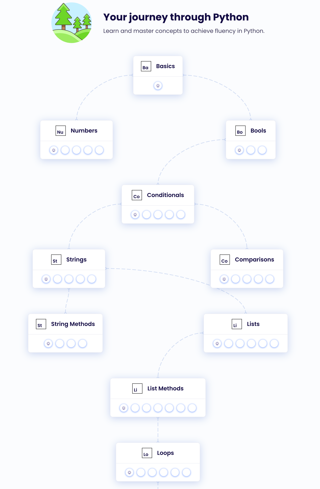

# Exercise

## Don't have to submit this part
- Setup: Get everything installed from the Quickstart
    - (Recommended) Package manager
        - MacOS: [Homebrew](https://brew.sh)
        - Windows: WSL - use apt
    - Python 3
    - VS Code
- Sign up for a GitHub account if you haven't already
- Git Basics: Read through the _Getting Started_ and _Collaborating_ sections of the [Atlassian git tutorial](https://www.atlassian.com/git/tutorials/setting-up-a-repository), really (okay to visit this first if you need help creating a fork of the Whirlwind Tour repository)
    - Microsoft also has a write-up on [Getting started with GitHub and Visual Studio Code](https://learn.microsoft.com/en-us/training/paths/get-started-github-and-visual-studio-code/)
- (Recommended) Python Foundations: Create an account on [Exercism](http://exercism.org/tracks/python) and work through the [python track](http://exercism.org/tracks/python) until you get to loops. That exercise is called _Making the Grade_, which you will complete and submit via GitHub.
    - Python Track on Exercism
        
        
        
## For submission
- Coding assignment:
    - Click on the GitHub Classroom assignment link (will be provided)
    - Create a `README.md` in the root directory of the repo that includes:
      - A brief introduction (first name only)
      - What you're hoping to get out of the course
      - A musical recommendation and a link to something about it
    - Complete the Python script that:
      - Takes an email address as a command line argument
      - Hashes the email using the specified algorithm
      - Redirects the output to a file named 'hash.email'
    - Commit and push your changes to submit
- (Optional) Work on the [Whirlwind Tour of Python](https://jakevdp.github.io/WhirlwindTourOfPython/) chapters (through ch7, "Control Flow Statements") alongside the notebooks [on GitHub](https://github.com/jakevdp/WhirlwindTourOfPython)
    1. Work through examples in your own development branch
    2. Commit your changes when you've reached good stopping points
    3. When you're ready for feedback, share it with someone else
    4. Try more [exercises on python basics](https://pythonbasics.org/exercises/) or search the web for exercises/examples specific to what you want to practice. [Python is the second-most popular programming language](https://octoverse.github.com/2022/top-programming-languages) (javascript runs the web at \#1), so there's a lot of material out there.
