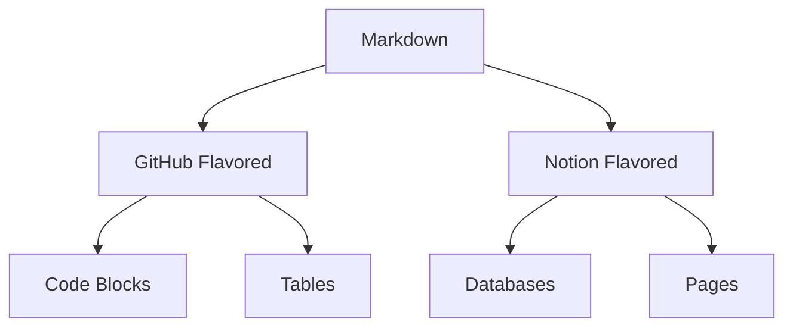

# Getting started with git, python, and R

## Overview

This lecture covers the fundamental tools and concepts needed for data science work.

## Tools

### Python, R, and Git

- Getting set up locally
- Cloud options (Colab, Binder, Paperspace, GitHub)

### Markdown



### Git and GitHub

- Starting or cloning a repository
- Git push/pull/sync
- Branches
- Conflicts

### Python

- Syntax basics
- Running python and jupyter
- Variables and control flow
- Common packages

## Lecture Materials

### Slides

<iframe src="https://www.notion.so/Lecture-1-Overview-44c1d71be20f4937a84dbe031c15cbfa?pvs=21" width="100%" height="600px" frameborder="0" allowfullscreen></iframe>

### Code Examples

```python
# Example coding block
def hello_world():
    print("Hello, Data Science!")
```

## Exercises

1. Set up your development environment
2. Create your first GitHub repository
3. Write a Python script to analyze some data

## Additional Resources

- [Python Documentation](https://docs.python.org/)
- [Git Documentation](https://git-scm.com/doc)
- [R Documentation](https://www.r-project.org/help.html)

## Next Steps

- Complete the exercises
- Review the lecture materials
- Prepare for the next lecture on data cleaning and wrangling 